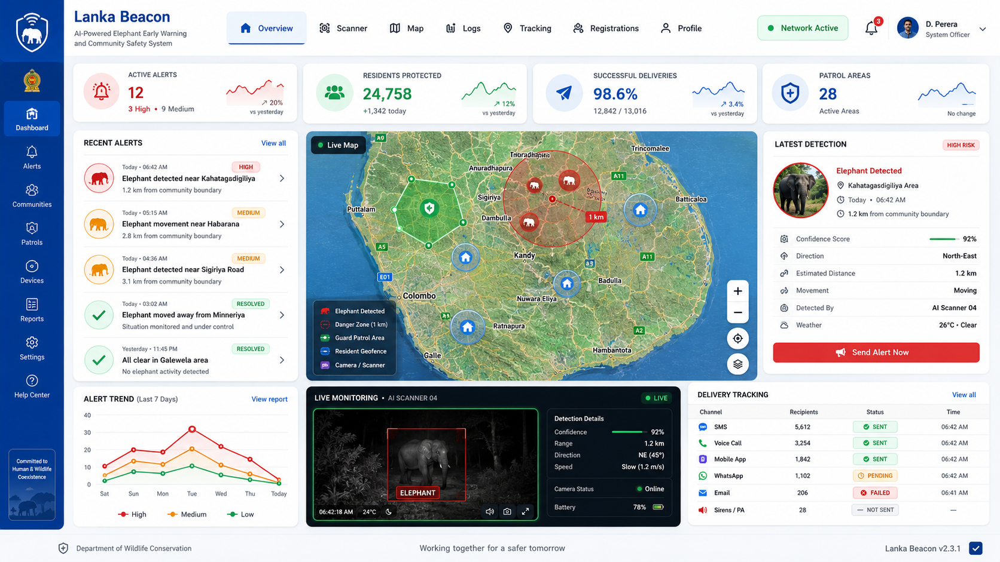

# LankaBeacon

LankaBeacon, also known as Elephant Guard, is an elephant detection and community alert system for Sri Lanka. It combines browser-based AI detection, location tracking, real-time dashboards, resident geofencing, and Telegram notifications to help wildlife guards respond to human-elephant encounters.

## Main features

- Browser-based elephant detection with TensorFlow.js and COCO-SSD
- Guard registration, authentication, profiles, and patrol areas
- Resident registration with location and geofence information
- Real-time alerts through Socket.IO
- Telegram notifications and resident response tracking
- Live Leaflet map with elephant, patrol-area, and resident markers
- Alert history, evidence images, delivery status, and spreadsheet export

## Technology stack

- Frontend: React, Vite, Tailwind CSS, Leaflet, TensorFlow.js, Axios, Socket.IO Client
- Backend: Node.js, Express, MongoDB, Mongoose, Socket.IO, JWT, Multer
- Integrations: Telegram Bot API

## Requirements

- Node.js and npm
- MongoDB database, either local or MongoDB Atlas
- Telegram bot token if Telegram alerts are enabled

## Environment setup

Never commit `.env` files. Copy the provided examples and replace the placeholders only in your local files.

Backend:

```bash
cd backend
copy .env.example .env
```

Required backend variables:

```env
PORT=5000
MONGO_URI=your_mongodb_connection_string
JWT_SECRET=your_secure_jwt_secret
TELEGRAM_BOT_TOKEN=your_telegram_bot_token
TELEGRAM_ENABLED=false
FRONTEND_URL=http://localhost:5173
NODE_ENV=development
ALERT_DEDUPE_WINDOW_MS=60000
ALERT_DEDUPE_DISTANCE_METERS=500
```

Frontend:

```bash
cd frontend
copy .env.example .env
```

The frontend example configures the API URL, Socket.IO URL, alert cooldown, and elephant-absence reset interval.

## MongoDB configuration

Set `MONGO_URI` in `backend/.env` to a local MongoDB connection string or a MongoDB Atlas connection string. Keep database usernames and passwords out of source control.

## Telegram bot configuration

1. Create a bot through Telegram's BotFather.
2. Put the bot token in `TELEGRAM_BOT_TOKEN` inside `backend/.env`.
3. Set `TELEGRAM_ENABLED=true`.
4. Register residents with the Telegram details required by the application.

Keep Telegram bot tokens and resident contact details private.

## Install and run

Backend:

```bash
cd backend
npm install
npm run dev
```

Frontend, in a second terminal:

```bash
cd frontend
npm install
npm run dev
```

The frontend normally runs at `http://localhost:5173`, and the backend uses port `5000` by default.

## Validation and production build

```bash
cd frontend
npm run lint
npm run build
```

Start the backend in production mode:

```bash
cd backend
npm start
```

The frontend production output is written to `frontend/dist/`. Build output, dependencies, logs, local uploads, and environment files are excluded from Git.

## Project structure

```text
Elephant-Guard/
|-- frontend/
|   |-- design-reference/   Public design images used by the application
|   |-- public/             Static public assets
|   `-- src/                React application
|-- backend/
|   |-- src/
|   |   |-- config/         Database configuration
|   |   |-- controllers/    API request handlers
|   |   |-- middleware/     Authentication and error handling
|   |   |-- models/         MongoDB models
|   |   |-- routes/         Express routes
|   |   `-- services/       Telegram, notification, and export services
|   `-- uploads/            Local private uploads; not committed
|-- .gitignore
`-- README.md
```

## Screenshot



## Security

- Do not commit `.env` files, database backups, private keys, bot tokens, passwords, recovery keys, or resident uploads.
- Rotate any credential immediately if it is exposed in Git history or logs.
- Review staged files with `git diff --cached` before every push.
